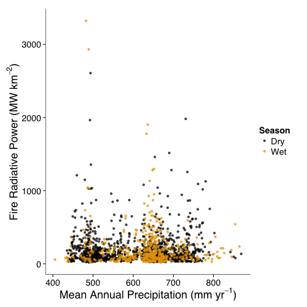
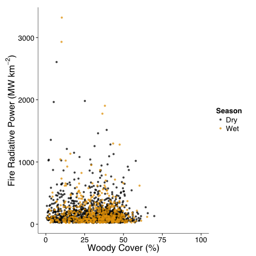

Spatial Drivers of Fire Intensity
========================================================


```r
FIRMS_highConfidence <- subset(FIRMS, CONFIDENCE >= 95)

FIRMS_highConfidence$ACQ_DATE <- ymd(as.character(FIRMS_highConfidence$ACQ_DATE))
FIRMS_highConfidence$Month <- month(FIRMS_highConfidence$ACQ_DATE)
FIRMS_Kruger_DrySeason <- subset(FIRMS_highConfidence, Month >= 7 & Month < 
    10)
FIRMS_Kruger_WetSeason <- subset(FIRMS_highConfidence, Month < 7 | Month > 10)

krugerBrick <- brick(krugerMAP_UTM, krugerAvgTmin_UTM, krugerFirelineIntensity_UTM, 
    krugerWoodyCover_UTM)

DrySeasonMAP <- extract(krugerBrick, FIRMS_Kruger_DrySeason, method = "bilinear", 
    df = TRUE, sp = TRUE)
WetSeasonMAP <- extract(krugerBrick, FIRMS_Kruger_WetSeason, method = "bilinear", 
    df = TRUE, sp = TRUE)

DrySeasonMAP <- as.data.frame(DrySeasonMAP)
WetSeasonMAP <- as.data.frame(WetSeasonMAP)

DrySeasonMAP$Season <- "Dry"
WetSeasonMAP$Season <- "Wet"

FRP_Variables <- rbind(DrySeasonMAP, WetSeasonMAP)

FRP_Variables_subsetWC <- subset(FRP_Variables, WoodyCover >= 50)
```


 


 

