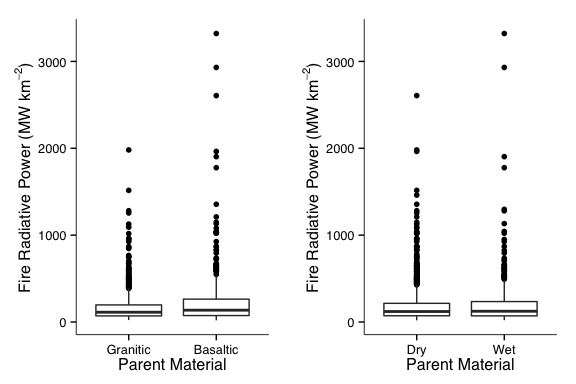

# Spatial Drivers of Fire Intensity

We don't know much about what drives fire intensity across different scales. To address this, fire radiative power data were obtained from [FIRMS](https://earthdata.nasa.gov/data/near-real-time-data/firms) for the period 1 Jan 2004 to 1 Jan 2014.

Data were subset to only include fire detections of > 95% confidence.

Fire detections were then associated with:
* Mean annual precipitation
* Geologic parent material
* Woody cover

**Methods**

**Figures**

<figure><figcaption>Figure 1: Fire radiative power by mean annual precipitation, subdivided by (A.) season of burn and (B.) geologic parent material.</figcaption></figure>

<figure><figcaption>Figure 2: Fire radiative power by percent woody cover, subdivided by (A.) season of burn and (B.) geologic parent material.</figcaption></figure>

<figure><figcaption>Figure 3: Fire radiative power by geology and season of burn.</figcaption></figure>

	Kruskal-Wallis rank sum test

data:  FRP by Geology
Kruskal-Wallis chi-squared = 13.26, df = 2, p-value = 0.001321

	Kruskal-Wallis rank sum test

data:  FRP by as.factor(Season)
Kruskal-Wallis chi-squared = 0.0077, df = 1, p-value = 0.9301
