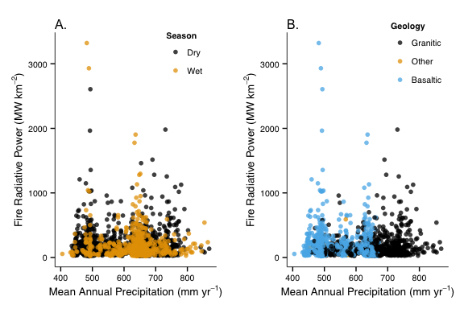

# Spatial Drivers of Fire Intensity


We don't know much about what drives fire intensity across different scales. To address this, fire radiative power data were obtained from [FIRMS](https://earthdata.nasa.gov/data/near-real-time-data/firms) for the period 1 Jan 2004 to 1 Jan 2014.

Data were subset to only include fire detections of > 95% confidence.

Fire detections were then associated with:
* Mean annual precipitation
* Geologic parent material
* Woody cover

**Methods**

Run the analyses related to the fire radiative power detections.


```r
source("Scripts/FIRMS_Map.R", echo = TRUE, verbose = FALSE)
```

```
## 
## > library(ggplot2)
## 
## > library(raster)
## 
## > library(rgdal)
## 
## > library(lubridate)
## 
## > crs.k <- CRS("+proj=utm +zone=36 +datum=WGS84 +units=m +no_defs +ellps=WGS84 +towgs84=0,0,0")
## 
## > crs.m <- CRS("+proj=longlat +datum=WGS84 +ellps=WGS84 +towgs84=0,0,0")
## 
## > FIRMS <- readOGR(dsn = "/Users/danielg7/Documents/FIRMS/", 
## +     layer = "firms138621406915198_MCD14ML")
## OGR data source with driver: ESRI Shapefile 
## Source: "/Users/danielg7/Documents/FIRMS/", layer: "firms138621406915198_MCD14ML"
## with 10370 features and 12 fields
## Feature type: wkbPoint with 2 dimensions
## 
## > krugerOutline <- readOGR(dsn = "/Users/danielg7/Documents/LandsatImagery/Boundary/", 
## +     layer = "boundary_kruger")
## OGR data source with driver: ESRI Shapefile 
## Source: "/Users/danielg7/Documents/LandsatImagery/Boundary/", layer: "boundary_kruger"
## with 1 features and 7 fields
## Feature type: wkbPolygon with 2 dimensions
## 
## > krugerAvgTmin_UTM <- raster(x = "/Users/danielgodwin/Dropbox/Graduate School/Dissertation/Chapter 2 - Ignition Variation/SpatialDriversofTopKill/Dat ..." ... [TRUNCATED] 
## 
## > krugerMAP_UTM <- raster(x = "/Users/danielgodwin/Dropbox/Graduate School/Dissertation/Chapter 2 - Ignition Variation/SpatialDriversofTopKill/Data/kr ..." ... [TRUNCATED] 
## 
## > krugerFirelineIntensity_UTM <- raster(x = "/Users/danielgodwin/Dropbox/Graduate School/Dissertation/Chapter 2 - Ignition Variation/SpatialDriversofT ..." ... [TRUNCATED] 
## 
## > krugerGly <- readOGR(dsn = "Data/", layer = "KNP_GraniticAndBasaltic")
## OGR data source with driver: ESRI Shapefile 
## Source: "Data/", layer: "KNP_GraniticAndBasaltic"
## with 2 features and 1 fields
## Feature type: wkbPolygon with 2 dimensions
## 
## > krugerWoodyCover <- raster(x = "Data/WoodyCover/wcp_map_fin.tif")
## 
## > krugerMAP_UTM <- resample(krugerMAP_UTM, krugerAvgTmin_UTM)
## 
## > krugerGly_UTM <- spTransform(krugerGly, crs.k)
## 
## > krugerFirelineIntensity_UTM <- resample(krugerFirelineIntensity_UTM, 
## +     krugerAvgTmin_UTM)
## 
## > krugerWoodyCover_UTM <- projectRaster(krugerWoodyCover, 
## +     krugerAvgTmin_UTM)
## 
## > krugerOverlayRaster <- raster(krugerWoodyCover_UTM)
## 
## > krugerGly_UTM <- spTransform(krugerGly, crs.k)
## 
## > krugerGlyRaster <- rasterize(krugerGly_UTM, krugerOverlayRaster)
## Found 2 region(s) and 14 polygon(s)
## 
## > names(krugerMAP_UTM) <- "MAP"
## 
## > names(krugerFirelineIntensity_UTM) <- "Fireline_Intensity"
## 
## > names(krugerWoodyCover_UTM) <- "WoodyCover"
## 
## > FIRMS <- spTransform(FIRMS, crs.k)
## 
## > krugerOutline <- spTransform(krugerOutline, crs.k)
## 
## > FIRMS_highConfidence <- subset(FIRMS, CONFIDENCE >= 
## +     95)
## 
## > FIRMS_highConfidence$ACQ_DATE <- ymd(as.character(FIRMS_highConfidence$ACQ_DATE))
## 
## > FIRMS_highConfidence$Month <- month(FIRMS_highConfidence$ACQ_DATE)
## 
## > FIRMS_Kruger_DrySeason <- subset(FIRMS_highConfidence, 
## +     Month >= 7 & Month < 10)
## 
## > FIRMS_Kruger_WetSeason <- subset(FIRMS_highConfidence, 
## +     Month < 7 | Month > 10)
## 
## > krugerBrick <- brick(krugerMAP_UTM, krugerAvgTmin_UTM, 
## +     krugerFirelineIntensity_UTM, krugerWoodyCover_UTM, krugerGlyRaster)
## 
## > DrySeasonMAP <- extract(krugerBrick, FIRMS_Kruger_DrySeason, 
## +     method = "bilinear", df = TRUE, sp = TRUE)
## 
## > WetSeasonMAP <- extract(krugerBrick, FIRMS_Kruger_WetSeason, 
## +     method = "bilinear", df = TRUE, sp = TRUE)
## 
## > DrySeasonMAP <- as.data.frame(DrySeasonMAP)
## 
## > WetSeasonMAP <- as.data.frame(WetSeasonMAP)
## 
## > DrySeasonMAP$Season <- "Dry"
## 
## > WetSeasonMAP$Season <- "Wet"
## 
## > FRP_Variables <- rbind(DrySeasonMAP, WetSeasonMAP)
## 
## > names(FRP_Variables)[18] <- "Geology"
## 
## > FRP_Variables$Geology <- as.factor(FRP_Variables$Geology)
## 
## > levels(FRP_Variables$Geology)[9] <- "Basaltic"
## 
## > levels(FRP_Variables$Geology)[1] <- "Granitic"
## 
## > levels(FRP_Variables$Geology)[c(2, 3, 4, 5, 6, 7, 
## +     8)] <- "Other"
## 
## > FRP_Variables_subsetWC <- subset(FRP_Variables, WoodyCover >= 
## +     50)
```
Run the model as it relates to predicting intensity.

```r
source("Scripts/IntensityMap.R", echo = TRUE, verbose = FALSE)
```

```
## 
## > library(ggplot2)
## 
## > library(raster)
## 
## > library(rgdal)
## 
## > library(lubridate)
## 
## > crs.k <- CRS("+proj=utm +zone=36 +datum=WGS84 +units=m +no_defs +ellps=WGS84 +towgs84=0,0,0")
## 
## > krugerAvgTmin_UTM <- raster(x = "/Users/danielgodwin/Dropbox/Graduate School/Dissertation/Chapter 2 - Ignition Variation/SpatialDriversofTopKill/Dat ..." ... [TRUNCATED] 
## 
## > krugerMAP_UTM <- raster(x = "/Users/danielgodwin/Dropbox/Graduate School/Dissertation/Chapter 2 - Ignition Variation/SpatialDriversofTopKill/Data/kr ..." ... [TRUNCATED] 
## 
## > krugerFRI <- readOGR(dsn = "Data/FRI/", layer = "fire return interval_1941to2006")
## OGR data source with driver: ESRI Shapefile 
## Source: "Data/FRI/", layer: "fire return interval_1941to2006"
## with 34856 features and 4 fields
## Feature type: wkbPolygon with 2 dimensions
## 
## > krugerFRI_UTM <- spTransform(krugerFRI, crs.k)
## 
## > krugerFRI_UTM <- subset(krugerFRI_UTM, MFRI <= 6)
## 
## > krugerFRIRaster <- raster(krugerMAP_UTM)
## 
## > krugerFRIRaster <- rasterize(krugerFRI_UTM, krugerFRIRaster, 
## +     field = krugerFRI_UTM$MFRI)
## Found 29349 region(s) and 29487 polygon(s)
## 
## > krugerBrick <- brick(krugerMAP_UTM, krugerFRIRaster)
## 
## > names(krugerBrick) <- c("MAP", "MFRI")
## 
## > krugerFuelLoad <- 382.9 + 3.3 * krugerBrick$MAP + 
## +     979.4 * krugerBrick$MFRI - 0.001 * krugerBrick$MFRI^2 + 0.37 * 
## +     krugerBrick$MAP * kru .... [TRUNCATED] 
## 
## > RelativeHumidity <- 36.6
## 
## > FuelMoisture <- 32.1
## 
## > WindSpeed <- 2.6
## 
## > krugerFirelineIntensity <- 2729 + 0.8684 * krugerFuelLoad - 
## +     530 * sqrt(FuelMoisture) - 0.1907 * RelativeHumidity^2 - 
## +     5961/WindSpeed
## 
## > krugerWoodyCover_UTM <- projectRaster(krugerWoodyCover, 
## +     krugerAvgTmin_UTM)
## 
## > names(krugerWoodyCover_UTM) <- "WoodyCover"
## 
## > krugerWoodyCover_newExtent <- resample(krugerWoodyCover_UTM, 
## +     krugerFirelineIntensity)
## 
## > krugerGlyRaster_newExtent <- resample(krugerGlyRaster, 
## +     krugerFirelineIntensity)
## 
## > krugerIntensityInvestigation <- brick(krugerWoodyCover_newExtent, 
## +     krugerFirelineIntensity, krugerGlyRaster_newExtent)
## 
## > krugerIntensityInvestigationDF <- na.omit(as.data.frame(krugerIntensityInvestigation))
## 
## > names(krugerIntensityInvestigationDF) <- c("WoodyCover", 
## +     "FirelineIntensity", "Geology")
## 
## > krugerIntensityInvestigationDF$Geology <- as.factor(krugerIntensityInvestigationDF$Geology)
## 
## > levels(krugerIntensityInvestigationDF$Geology) <- c("Granitic", 
## +     "Basaltic")
```

**Figures**

<figure><br><figcaption>Figure 1: Fire radiative power by mean annual precipitation, subdivided by (A.) season of burn and (B.) geologic parent material.</figcaption></figure><br>

<figure><br><figcaption>Figure 2: Fire radiative power by percent woody cover, subdivided by (A.) season of burn and (B.) geologic parent material.</figcaption></figure><br>

<figure><br><figcaption>Figure 3: Fire radiative power by geology and season of burn.</figcaption></figure><br>
**Kruskal-Wallis Tests**

```
## 
## 	Kruskal-Wallis rank sum test
## 
## data:  FRP by Geology
## Kruskal-Wallis chi-squared = 13.26, df = 2, p-value = 0.001321
```

```
## 
## 	Kruskal-Wallis rank sum test
## 
## data:  FRP by as.factor(Season)
## Kruskal-Wallis chi-squared = 0.0077, df = 1, p-value = 0.9301
```

No significant difference by seasonality, but there is a difference by geologic parent material.


<figure><br><figcaption>Figure 4: Modeled fireline intensity across Kruger National Park</figcaption></figure><br>

<figure><br><figcaption>Figure 5: Modeled fireline intensity by percent woody cover and geologic parent material.</figcaption></figure><br>


[Analyses of Data on Spatial Drivers of Top Kill](http://github.com/danielg7/SpatialDriversOfTopKill/) by Daniel Godwin is licensed under a [Creative Commons Attribution-NonCommercial-NoDerivatives 4.0 International License](http://creativecommons.org/licenses/by-nc-nd/4.0/).
