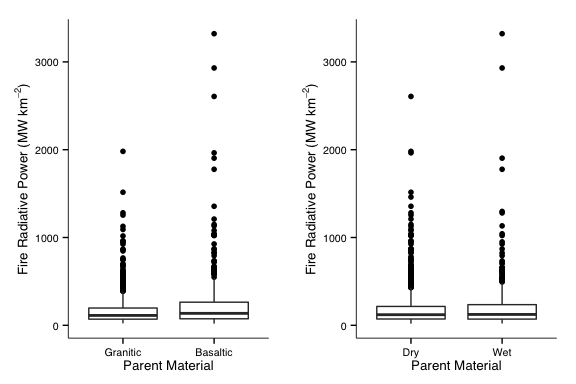

# Spatial Drivers of Fire Intensity

We don't know much about what drives fire intensity across different scales. To address this, fire radiative power data were obtained from [FIRMS](https://earthdata.nasa.gov/data/near-real-time-data/firms) for the period 1 Jan 2004 to 1 Jan 2014.

Data were subset to only include fire detections of > 95% confidence.

Fire detections were then associated with
* Mean annual precipitation
* Geologic parent material
* Woody cover

**Methods**

**Figures**

1. Fire Radiative Power by Mean Annual Precipitation
 
2. Fire Radiative Power by Percent Woody Cover and Season
 
3. Fire Radiative Power by Geology

 
