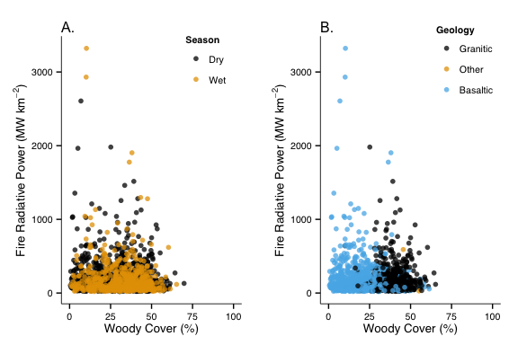
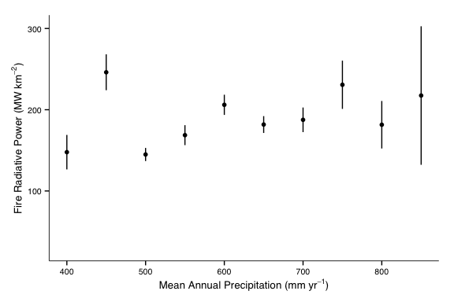
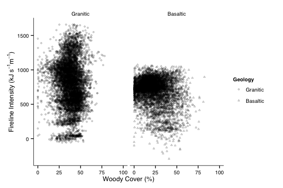

# Spatial Drivers of Fire Intensity


We don't know much about what drives fire intensity across different scales. To address this, fire radiative power data were obtained from [FIRMS](https://earthdata.nasa.gov/data/near-real-time-data/firms) for the period 1 Jan 2004 to 1 Jan 2014.

Data were subset to only include fire detections of > 95% confidence.

Fire detections were then associated with:
* Mean annual precipitation
* Geologic parent material
* Woody cover

**Methods**

Run the analyses related to the fire radiative power detections.


```r
source("Scripts/FIRMS_Map.R",echo=FALSE,verbose = FALSE)
```

```
## OGR data source with driver: ESRI Shapefile 
## Source: "/Users/danielg7/Documents/FIRMS/", layer: "firms138621406915198_MCD14ML"
## with 10370 features and 12 fields
## Feature type: wkbPoint with 2 dimensions
## OGR data source with driver: ESRI Shapefile 
## Source: "/Users/danielg7/Documents/LandsatImagery/Boundary/", layer: "boundary_kruger"
## with 1 features and 7 fields
## Feature type: wkbPolygon with 2 dimensions
## OGR data source with driver: ESRI Shapefile 
## Source: "Data/", layer: "KNP_GraniticAndBasaltic"
## with 2 features and 1 fields
## Feature type: wkbPolygon with 2 dimensions
## Found 2 region(s) and 14 polygon(s)
```
Run the model as it relates to predicting intensity.

```r
source("Scripts/IntensityMap.R",echo=FALSE,verbose = FALSE)
```

```
## OGR data source with driver: ESRI Shapefile 
## Source: "Data/FRI/", layer: "fire return interval_1941to2006"
## with 34856 features and 4 fields
## Feature type: wkbPolygon with 2 dimensions
## Found 29349 region(s) and 29487 polygon(s)
```
Run the Fire Scar Analysis

```r
source("Scripts/FireScar_Analysis.R",echo=FALSE,verbose = FALSE)
```

```
## OGR data source with driver: ESRI Shapefile 
## Source: "Data/BurnScars/", layer: "agg2"
## with 3533 features and 12 fields
## Feature type: wkbPolygon with 2 dimensions
```
Run the intensity model analysis


**Figures**

<figure><br><figcaption>Figure 2: </figcaption></figure><br>
A. Average woody cover by mean annual precipitation at 50 mm/yr intervals (points); line is significant at P < 0.01, R^2 = 0.5862. B. Relationship between fuel load accumulation (grass biomass) and mean annual precipitation, derived from Figure 1, Govender et al. 2006. C. Relationship between fireline intensity and fuel load given an average rate of spread of .04 m/s. D. Relationship between average fireline intensity and mean annual precipitation, from Figure 2, Govender et al. 2006. E. Probability of top kill as a function of fire intensity by mean annual precipitation, as a function of Higgins et al. 2011 and the relationship shown in D.


<figure><br><figcaption>Figure 3: Fire radiative power by mean annual precipitation, subdivided by (A.) season of burn and (B.) geologic parent material.</figcaption></figure><br>

<figure><br><figcaption>Figure 4: Fire radiative power by percent woody cover, subdivided by (A.) season of burn and (B.) geologic parent material.</figcaption></figure><br>

<figure><br><figcaption>Figure 5: Fire radiative power by geology and season of burn.</figcaption></figure><br>

<figure><br><figcaption>Figure 6: Fire radiative power, averaged by 50 mm / yr MAP</figcaption></figure><br>
**Kruskal-Wallis Tests**

```
## 
## 	Kruskal-Wallis rank sum test
## 
## data:  FRP by Geology
## Kruskal-Wallis chi-squared = 13.26, df = 2, p-value = 0.001321
```

```
## 
## 	Kruskal-Wallis rank sum test
## 
## data:  FRP by as.factor(Season)
## Kruskal-Wallis chi-squared = 0.0077, df = 1, p-value = 0.9301
```

No significant difference by seasonality, but there is a difference by geologic parent material.


<figure><br><figcaption>Figure 7: Modeled fireline intensity across Kruger National Park</figcaption></figure><br>

<figure><br><figcaption>Figure 8: Modeled probability of topkill of a one meter sapling across Kruger National Park</figcaption></figure><br>

<figure><br><figcaption>Figure 9: Modeled average fireline intensity by percent woody cover and geologic parent material.</figcaption></figure><br>

<figure><br><figcaption>Figure 10: Modeled fireline intensity by MAP and geologic parent material.</figcaption></figure><br>

<figure><br><figcaption>Figure 11: Percentage of probable fires by fireline intensity classes, as defined by Govender et al. 2006</figcaption></figure><br>


<figure><br><figcaption>Figure 12: Probability of Top Kill by Mean Annual Precipitation, modeled.</figcaption></figure><br>


**Intensity by Woody Cover and MAP: GLM Results**

<table cellspacing="0" style="border: none;">
  <tr>
    <th style="text-align: left; border-top: 2px solid black; border-bottom: 1px solid black; padding-right: 12px;"></th>
    <th style="text-align: left; border-top: 2px solid black; border-bottom: 1px solid black; padding-right: 12px;"><b>Model 1</b></th>
    <th style="text-align: left; border-top: 2px solid black; border-bottom: 1px solid black; padding-right: 12px;"><b>Model 2</b></th>
  </tr>
  <tr>
    <td style="padding-right: 12px; border: none;">(Intercept)</td>
    <td style="padding-right: 12px; border: none;">902.88 (3.15)<sup style="vertical-align: 4px;">***</sup></td>
    <td style="padding-right: 12px; border: none;">902.69 (3.15)<sup style="vertical-align: 4px;">***</sup></td>
  </tr>
  <tr>
    <td style="padding-right: 12px; border: none;">WoodyCover</td>
    <td style="padding-right: 12px; border: none;"></td>
    <td style="padding-right: 12px; border: none;">0.00 (0.00)<sup style="vertical-align: 4px;">**</sup></td>
  </tr>
  <tr>
    <td style="border-top: 1px solid black;">AIC</td>
    <td style="border-top: 1px solid black;">217862.94</td>
    <td style="border-top: 1px solid black;">217854.87</td>
  </tr>
  <tr>
    <td style="padding-right: 12px; border: none;">BIC</td>
    <td style="padding-right: 12px; border: none;">217878.14</td>
    <td style="padding-right: 12px; border: none;">217877.68</td>
  </tr>
  <tr>
    <td style="padding-right: 12px; border: none;">Log Likelihood</td>
    <td style="padding-right: 12px; border: none;">-108929.47</td>
    <td style="padding-right: 12px; border: none;">-108924.44</td>
  </tr>
  <tr>
    <td style="padding-right: 12px; border: none;">Deviance</td>
    <td style="padding-right: 12px; border: none;">2165327697.19</td>
    <td style="padding-right: 12px; border: none;">2163854972.63</td>
  </tr>
  <tr>
    <td style="border-bottom: 2px solid black;">Num. obs.</td>
    <td style="border-bottom: 2px solid black;">14788</td>
    <td style="border-bottom: 2px solid black;">14788</td>
  </tr>
  <tr>
    <td style="padding-right: 12px; border: none;" colspan="3"><span style="font-size:0.8em"><sup style="vertical-align: 4px;">***</sup>p &lt; 0.001, <sup style="vertical-align: 4px;">**</sup>p &lt; 0.01, <sup style="vertical-align: 4px;">*</sup>p &lt; 0.05</span></td>
  </tr>
</table>

<table cellspacing="0" style="border: none;">
  <tr>
    <th style="text-align: left; border-top: 2px solid black; border-bottom: 1px solid black; padding-right: 12px;"></th>
    <th style="text-align: left; border-top: 2px solid black; border-bottom: 1px solid black; padding-right: 12px;"><b>Model 1</b></th>
    <th style="text-align: left; border-top: 2px solid black; border-bottom: 1px solid black; padding-right: 12px;"><b>Model 2</b></th>
  </tr>
  <tr>
    <td style="padding-right: 12px; border: none;">(Intercept)</td>
    <td style="padding-right: 12px; border: none;">902.88 (3.15)<sup style="vertical-align: 4px;">***</sup></td>
    <td style="padding-right: 12px; border: none;">-1427.79 (8.76)<sup style="vertical-align: 4px;">***</sup></td>
  </tr>
  <tr>
    <td style="padding-right: 12px; border: none;">MAP</td>
    <td style="padding-right: 12px; border: none;"></td>
    <td style="padding-right: 12px; border: none;">4.10 (0.02)<sup style="vertical-align: 4px;">***</sup></td>
  </tr>
  <tr>
    <td style="border-top: 1px solid black;">AIC</td>
    <td style="border-top: 1px solid black;">217862.94</td>
    <td style="border-top: 1px solid black;">191637.42</td>
  </tr>
  <tr>
    <td style="padding-right: 12px; border: none;">BIC</td>
    <td style="padding-right: 12px; border: none;">217878.14</td>
    <td style="padding-right: 12px; border: none;">191660.23</td>
  </tr>
  <tr>
    <td style="padding-right: 12px; border: none;">Log Likelihood</td>
    <td style="padding-right: 12px; border: none;">-108929.47</td>
    <td style="padding-right: 12px; border: none;">-95815.71</td>
  </tr>
  <tr>
    <td style="padding-right: 12px; border: none;">Deviance</td>
    <td style="padding-right: 12px; border: none;">2165327697.19</td>
    <td style="padding-right: 12px; border: none;">367513431.41</td>
  </tr>
  <tr>
    <td style="border-bottom: 2px solid black;">Num. obs.</td>
    <td style="border-bottom: 2px solid black;">14788</td>
    <td style="border-bottom: 2px solid black;">14788</td>
  </tr>
  <tr>
    <td style="padding-right: 12px; border: none;" colspan="3"><span style="font-size:0.8em"><sup style="vertical-align: 4px;">***</sup>p &lt; 0.001, <sup style="vertical-align: 4px;">**</sup>p &lt; 0.01, <sup style="vertical-align: 4px;">*</sup>p &lt; 0.05</span></td>
  </tr>
</table>

<figure><br><figcaption>Figure 13: Reported impacts of fire.</figcaption></figure><br>

<figure><br><figcaption>Figure 14: Impact on woody cover and herbaceous material by mean annual precipitation (A,B). Relationship between percent woody cover and reported impact on woody cover and herbaceous material (C,D).</figcaption></figure><br>


<table cellspacing="0" style="border: none;">
  <tr>
    <th style="text-align: left; border-top: 2px solid black; border-bottom: 1px solid black; padding-right: 12px;"></th>
    <th style="text-align: left; border-top: 2px solid black; border-bottom: 1px solid black; padding-right: 12px;"><b>Model 1</b></th>
    <th style="text-align: left; border-top: 2px solid black; border-bottom: 1px solid black; padding-right: 12px;"><b>Model 2</b></th>
  </tr>
  <tr>
    <td style="padding-right: 12px; border: none;">(Intercept)</td>
    <td style="padding-right: 12px; border: none;">3.07 (0.11)<sup style="vertical-align: 4px;">***</sup></td>
    <td style="padding-right: 12px; border: none;">3.96 (0.30)<sup style="vertical-align: 4px;">***</sup></td>
  </tr>
  <tr>
    <td style="padding-right: 12px; border: none;">WoodyCover</td>
    <td style="padding-right: 12px; border: none;"></td>
    <td style="padding-right: 12px; border: none;">-0.03 (0.01)<sup style="vertical-align: 4px;">**</sup></td>
  </tr>
  <tr>
    <td style="border-top: 1px solid black;">AIC</td>
    <td style="border-top: 1px solid black;">208.01</td>
    <td style="border-top: 1px solid black;">200.20</td>
  </tr>
  <tr>
    <td style="padding-right: 12px; border: none;">BIC</td>
    <td style="padding-right: 12px; border: none;">212.64</td>
    <td style="padding-right: 12px; border: none;">207.15</td>
  </tr>
  <tr>
    <td style="padding-right: 12px; border: none;">Log Likelihood</td>
    <td style="padding-right: 12px; border: none;">-102.00</td>
    <td style="padding-right: 12px; border: none;">-97.10</td>
  </tr>
  <tr>
    <td style="padding-right: 12px; border: none;">Deviance</td>
    <td style="padding-right: 12px; border: none;">66.67</td>
    <td style="padding-right: 12px; border: none;">58.49</td>
  </tr>
  <tr>
    <td style="border-bottom: 2px solid black;">Num. obs.</td>
    <td style="border-bottom: 2px solid black;">75</td>
    <td style="border-bottom: 2px solid black;">75</td>
  </tr>
  <tr>
    <td style="padding-right: 12px; border: none;" colspan="3"><span style="font-size:0.8em"><sup style="vertical-align: 4px;">***</sup>p &lt; 0.001, <sup style="vertical-align: 4px;">**</sup>p &lt; 0.01, <sup style="vertical-align: 4px;">*</sup>p &lt; 0.05</span></td>
  </tr>
</table>

<figure><br><figcaption>Figure 15: Role of previous two years of mean annual precipitation on reported impacts on woody species (A.) and herbaceous cover (B.)</figcaption></figure><br>

[Analyses of Data on Spatial Drivers of Top Kill](http://github.com/danielg7/SpatialDriversOfTopKill/) by Daniel Godwin is licensed under a [Creative Commons Attribution-NonCommercial-NoDerivatives 4.0 International License](http://creativecommons.org/licenses/by-nc-nd/4.0/).
